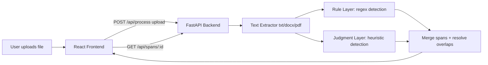

# Conseal Hackathon — Problem Statement 1: Trust & Explainability
## Development Blueprint (Solo / 8-Hour Build)

This blueprint is intentionally scoped to what one person can build, demo, and explain well in 8 hours. It deliberately excludes enterprise concerns (auth systems, relational databases, CI/CD, load testing, monitoring stacks) because they solve problems this prototype doesn't have, and every hour spent on them is an hour not spent on the thing being judged: the trust experience itself.

---

## 1. Problem Statement Analysis

**The problem.** Marcus has a sensitive document he wants to run through an AI tool. He's been burned before — he's heard of "redacted" files where the sensitive content was still recoverable underneath. He won't adopt a tool he can't interrogate. Every redaction needs a reason; every non-redaction needs a reason too. Silence reads as a miss.

**Objective.** Build an interface where a real person, not a developer, can click on any decision Conseal made (hide or don't-hide) and get a clear, honest answer to "why this, and why not that?" — strong enough that an anxious, skeptical user would actually start trusting the tool.

**Stakeholder.** One persona: Marcus. No admin, no team, no multi-user concerns.

**Pain points being solved.** Fear of incomplete redaction. Fear of false confidence ("it says it's safe but is it really?"). Fear of opacity — a tool that just does things without explaining itself.

**Expected outcome.** A working prototype: load a sample document, see its redaction decisions, click any decision, get a real explanation, optionally adjust a confidence threshold and watch the redaction set respond live.

**Assumptions.**
- Detection runs locally and deterministically — no live LLM call anywhere in the runtime path. This is the "mock backend" choice from the brief, but it does **not** mean fake results: the user uploads a real file and gets real detection, just not AI-model-based detection. This removes 100% of demo risk (no API keys, no rate limits, no network dependency, nothing that can fail on stage) while still letting the user upload their own document, exactly as the brief instructs.
- Detection is a two-stage pipeline (see Section 4a): a **rule layer** (real regex, genuinely deterministic, genuinely explainable) and a **judgment layer** (a heuristic standing in for where an ML model would sit in production — confidence here is intentionally shown as softer, which is itself part of the trust story).
- One sample/uploaded document is processed at a time (the brief does not require multi-document support for this problem).
- Both Conseal's real modes (Redact = permanent black-box, Anonymize = recoverable token + map) are relevant to model, since "is it really gone?" is Marcus's core fear and the mode determines the true answer.

**Constraints.** 8 hours, solo, no live API dependency, must run locally with trivial setup (a judge or interviewer should be able to clone and run it in under 5 minutes).

**Success criteria.** Every redaction and every kept-visible span is clickable and explained. The explanation differentiates rule-based certainty from softer AI-judgment confidence. Redact vs. Anonymize mode is visibly modeled. The UI looks intentional, not like a debug page. A 2-minute video can show the full loop: anxious framing → click a decision → see the reasoning → come away convinced.

---

## 2. Functional Requirements

### F0. File Upload & Local Processing
**Purpose.** Let Marcus upload his own document, matching how the real Conseal app works ("drop your file"), rather than only ever showing a canned example.
**User flow.** User drags/drops or selects a `.txt`, `.docx`, or `.pdf` → backend extracts raw text → backend runs the two-stage detection pipeline (Section 4a) → frontend receives the document text plus the resulting span list and renders it.
**Inputs.** File (`.txt`, `.docx`, `.pdf`).
**Outputs.** `{ document_text, spans: [...] }`, same shape as the rest of this spec already assumes.
**Edge cases.** Empty file; file with no detectable PII at all (should still render cleanly, not error); very large file (cap and show a friendly message rather than hanging); corrupted/unsupported file type (clear error, no crash).
**Validation.** Restrict accepted MIME types client-side and server-side; cap file size (a few MB is plenty for a hackathon demo).

### F1. Document Viewer with Inline Span Highlighting
**Purpose.** Let Marcus see his actual document with decisions overlaid in context, not in a separate disconnected list.
**User flow.** Document loads → spans are highlighted (redacted spans as black/blurred boxes, kept-but-flagged spans with a subtle marker) → user clicks any span → detail panel opens.
**Inputs.** Static document text + span list (from mock backend).
**Outputs.** Rendered document with inline highlights.
**Edge cases.** Overlapping spans (e.g., a name inside an address); spans at the very start/end of text; spans containing punctuation.
**Validation.** Span character offsets must not exceed document length; spans must not silently overlap without a defined precedence rule.

### F2. Explanation Panel
**Purpose.** Answer "why this, why not that" for any clicked span.
**User flow.** Click span → panel shows: span text, PII type, detection method (rule-matched vs. AI-judged), confidence score, mode (Redact/Anonymize), and a one-sentence plain-language reason.
**Inputs.** Span ID.
**Outputs.** Explanation object.
**Edge cases.** Borderline confidence (around the threshold) should be visually distinct from clear-cut cases, not styled identically.
**Validation.** Every span must have a non-empty reason string — no silent or generic placeholders.

### F3. Symmetric Treatment of Kept-Visible Content
**Purpose.** This is the single most important differentiator for this problem. Content that was scanned and deliberately left visible must be explained with the same seriousness as redacted content — not as an afterthought.
**User flow.** Kept-visible spans are visually marked (e.g., dotted underline) and clickable just like redactions, opening the same kind of explanation panel with reasoning like "flagged as a possible name, but matched a common dictionary word with low confidence."
**Inputs/Outputs.** Same shape as F2.
**Edge cases.** A span that was *considered* and rejected vs. plain text that was never flagged at all — these should be distinguishable so Marcus can tell the difference between "checked and cleared" and "never looked at."
**Validation.** At minimum 2–3 deliberately tricky "kept visible" examples in the mock data (see Section 7).

### F4. Confidence Threshold Slider
**Purpose.** Let Marcus calibrate trust himself rather than accept one fixed answer. This converts "trust" from a binary into something tunable, which is the most product-thinking-forward feature in the build.
**User flow.** Slider from 0–100. As it moves, spans below the threshold are dynamically shown as redacted; spans above remain visible (or vice versa, depending on framing). Document re-renders live.
**Inputs.** Slider value (client-side state only).
**Outputs.** Filtered redaction view.
**Edge cases.** Threshold at exact boundary values (0, 100); spans with identical confidence scores.
**Validation.** Purely client-side filtering against the already-loaded span list — no new API calls needed per slider move.

### F5. Mode Indicator (Redact vs. Anonymize)
**Purpose.** Directly answers Marcus's literal fear — "is the redacted content really gone, or just hidden?" — by surfacing which mode was applied and what that guarantees.
**User flow.** Each redacted span shows a small tag: "Redacted — permanently removed" or "Anonymized — recoverable via map." Clicking it can show a short explainer of what that means.
**Inputs/Outputs.** Mode field on each span.
**Edge cases.** None significant; this is largely a labeling feature.
**Validation.** Every redacted span must have a mode value; no span should be ambiguous about whether it's recoverable.

---

## 3. User Roles

Single role: **Viewer (Marcus)**. No authentication, no accounts, no permission tiers. This is a deliberate scope decision — multi-user concerns would consume hours solving a problem this persona doesn't have.

---

## 4. System Architecture (Lean)



- **Frontend**: React + Vite, Tailwind for styling. Adds a file-drop component on top of the document viewer.
- **Backend**: FastAPI. Adds a text-extraction step (`python-docx` for Word, `pdfplumber` for PDF, plain read for `.txt`) and the two-stage detection pipeline described in 4a. No database, no ORM — the processed result for the current document is held in memory for the session.
- **Storage**: none persistent. The uploaded file and its extracted text/spans live only in memory for that session; nothing is written to disk beyond what the upload temporarily needs.
- **No live LLM call anywhere** — this is what makes it a "mock backend" per the brief, while still being a real, working detection pipeline against real uploaded content.
- **No auth, no background jobs, no notifications, no monitoring stack** — none of these solve a problem this prototype has.
- **Logging**: FastAPI's default request logging is sufficient.

### 4a. Two-Stage Detection Pipeline (this is the core engineering piece)

**Stage 1 — Rule layer (real, deterministic).**
Regex patterns for structured PII types: email addresses, US/international phone formats, SSN-like numbers, account/policy-number patterns (e.g. letter-digit-hyphen combinations), dates. Each match is reported with `detection_method: "rule_matched"` and a high, genuinely-earned confidence (e.g. 0.97–0.99) because the logic is exact-match, not probabilistic.

**Stage 2 — Judgment layer (heuristic, standing in for an ML model).**
For unstructured PII — person names, locations, context-dependent sensitive terms — use a lightweight heuristic rather than a live model call:
- Candidate name detection: consecutive capitalized words, boosted in confidence if preceded by a title-like cue ("Mr.", "Dr.", "Patient", "Mx.", etc.), penalized if the word matches a small list of common non-name capitalized words (e.g. month names, "The", sentence-initial capitals).
- Candidate location detection: a small fixed gazetteer of common city/country names (a few dozen entries is enough for a demo) — found matches get a moderate, explicitly-labeled-as-soft confidence (e.g. 0.5–0.7), since real-world re-identification risk from a city name alone is genuinely lower and more judgment-dependent than a phone number.
- Each result is reported with `detection_method: "heuristic_judged"` and a deliberately wider, lower confidence range than the rule layer — this honesty about uncertainty is itself part of the trust story for Marcus, not a weakness to hide.

**Merge rule.** If the rule layer and judgment layer both flag overlapping text, the rule-layer result wins (it's exact-match, more certain). If only the judgment layer flags something, it's surfaced with its own lower confidence, clearly tagged as heuristic. This merge logic is the entire "model layering" architecture — no orchestration framework, ensemble voting, or fine-tuning required, and it is fully explainable in your writeup as "two independent, complementary detectors with a precedence rule," which is a legitimate and honest engineering description.

**Why this satisfies the brief.** The brief's two options are "cloud LLM" or "mock backend." This pipeline is squarely Option B — there's no AI model inference happening — while still operating on a real uploaded file rather than one fixed canned example, which is what you were asked to support.

---

## 5. Folder Structure

```
conseal-ps1/
├── backend/
│   ├── main.py              # FastAPI app, route definitions
│   ├── models.py            # Pydantic models: PIISpan, Explanation
│   ├── extraction.py        # txt/docx/pdf text extraction
│   ├── detection/
│   │   ├── rule_layer.py    # regex-based detectors
│   │   ├── judgment_layer.py # heuristic name/location detectors
│   │   └── merge.py         # overlap resolution + precedence rule
│   ├── sample_doc.txt       # fallback/demo document if no upload yet
│   └── requirements.txt
├── frontend/
│   ├── src/
│   │   ├── components/
│   │   │   ├── FileUpload.jsx
│   │   │   ├── DocumentViewer.jsx
│   │   │   ├── SpanHighlight.jsx
│   │   │   ├── ExplanationPanel.jsx
│   │   │   ├── ConfidenceSlider.jsx
│   │   │   └── ModeTag.jsx
│   │   ├── App.jsx
│   │   └── main.jsx
│   ├── index.html
│   └── package.json
├── README.md                 # setup + run instructions
└── WRITEUP.md                # what was built, what wasn't, and why
```

---

## 6. Technology Stack

| Layer | Choice | Why |
|---|---|---|
| Frontend | React + Vite + Tailwind | Fast to scaffold, you already know this stack well, no build-tool friction |
| Backend | FastAPI | Minimal boilerplate, automatic OpenAPI docs, matches your existing comfort zone |
| Data | Static JSON file | Zero setup, zero failure modes, perfectly adequate for one document's worth of spans |
| Hosting (demo) | Local only | No deployment needed for an 8-hour build; run both servers locally for the video/demo |

Deliberately excluded: a real database, ORM, cloud deployment, caching layer, CI/CD — none are proportionate to a single-document, single-session prototype.

---

## 7. Sample Document & Detection Output Shape

Since the pipeline now processes real uploaded files, you don't need a static mock dataset as your *only* data source — but you should still keep one sample document (`sample_doc.txt`) on hand as a fallback for the demo (in case a judge's laptop has upload friction) and as a quick way to sanity-check your detectors while building. The shape below is what your pipeline should *produce*, regardless of whether the input came from an upload or the fallback file:

```json
{
  "document_text": "Patient Jonathan M. Richardson was admitted to Meridian Medical Center, San Francisco, with coverage confirmed under BC-2847391-MH. The patient is married and authorized release of PHI per HIPAA §164.506. Designated emergency contact is reachable at (415) 555-0142; primary email on file is j.richardson@meridian-health.org.",
  "spans": [
    {
      "id": "span_1",
      "text": "Jonathan M. Richardson",
      "start": 8,
      "end": 31,
      "type": "PERSON_NAME",
      "decision": "redacted",
      "mode": "anonymize",
      "detection_method": "heuristic_judged",
      "confidence": 0.78,
      "reason": "Two consecutive capitalized words following 'Patient', a strong name cue; flagged by the judgment layer with moderate-high confidence."
    },
    {
      "id": "span_2",
      "text": "BC-2847391-MH",
      "start": 95,
      "end": 108,
      "type": "POLICY_NUMBER",
      "decision": "redacted",
      "mode": "redact",
      "detection_method": "rule_matched",
      "confidence": 0.99,
      "reason": "Matched strict alphanumeric policy-number regex; permanently removed, not recoverable."
    },
    {
      "id": "span_3",
      "text": "(415) 555-0142",
      "start": 210,
      "end": 224,
      "type": "PHONE_NUMBER",
      "decision": "redacted",
      "mode": "anonymize",
      "detection_method": "rule_matched",
      "confidence": 0.99,
      "reason": "Matched standard US phone regex; high deterministic confidence."
    },
    {
      "id": "span_4",
      "text": "j.richardson@meridian-health.org",
      "start": 250,
      "end": 283,
      "type": "EMAIL",
      "decision": "redacted",
      "mode": "anonymize",
      "detection_method": "rule_matched",
      "confidence": 0.99,
      "reason": "Matched standard email regex."
    },
    {
      "id": "span_5",
      "text": "married",
      "start": 140,
      "end": 147,
      "type": "MARITAL_STATUS",
      "decision": "kept_visible",
      "mode": null,
      "detection_method": "heuristic_judged",
      "confidence": 0.30,
      "reason": "No rule or heuristic confidently classified this as sensitive on its own; kept visible. Borderline — adjust the threshold if you'd rather be cautious here."
    },
    {
      "id": "span_6",
      "text": "HIPAA \u00a7164.506",
      "start": 170,
      "end": 185,
      "type": "REGULATORY_CITATION",
      "decision": "kept_visible",
      "mode": null,
      "detection_method": "rule_matched",
      "confidence": 0.95,
      "reason": "Matched the regulatory-citation pattern, explicitly excluded from PII by design \u2014 confidently cleared, not just unflagged."
    },
    {
      "id": "span_7",
      "text": "San Francisco",
      "start": 60,
      "end": 73,
      "type": "LOCATION",
      "decision": "kept_visible",
      "mode": null,
      "detection_method": "heuristic_judged",
      "confidence": 0.55,
      "reason": "Matched the city gazetteer; city-level locations are common enough that re-identification risk was judged low \u2014 a judgment call, not a certainty."
    }
  ]
}
```

This output shape is identical whether the source was a real upload or the fallback file, which is exactly the point: the frontend never needs to know or care which path produced it.

---

## 8. API Design

| Method | Route | Description | Response |
|---|---|---|---|
| POST | `/api/process` | Accepts an uploaded file (multipart), runs extraction + two-stage detection, returns the result | `{ document_text, spans: [...] }` |
| GET | `/api/sample` | Returns the fallback sample document already processed (no upload needed) — useful for instant demo/testing | `{ document_text, spans: [...] }` |
| GET | `/api/spans/{span_id}` | Returns full explanation for one span from the currently loaded document | Single span object |

No auth headers, no pagination. A 415 for unsupported file types and a 413 for oversized uploads are the only error codes you need beyond the standard 404 for an unknown span ID.

---

## 9. UI/UX Design (Conseal-inspired)

**Visual language**: light background (`#F8FAFC`-ish), Conseal's blue accent (`#2563EB`-ish) for interactive elements and highlights, dark navy (`#0F172A`-ish) for primary text and headers, generous whitespace, rounded cards with soft borders — matching the clean, minimal SaaS look from the real site rather than introducing unrelated dark-mode/glassmorphism styling not present in the brand.

**Screen: Document Review (single screen, no navigation needed)**
- **Top bar**: "Conseal — Redaction Review" wordmark, subtle.
- **Left/main panel**: the document text, rendered with inline spans. Redacted spans render as solid dark blocks (with a small lock icon) for `redact` mode, or as a labelled pill like `[NAME_1]` for `anonymize` mode. Kept-visible flagged spans get a dotted underline in the accent blue.
- **Right panel** (slides in on click): explanation card — type badge, confidence as a horizontal bar (not just a number, so the eye catches low-confidence cases), detection method tag ("Rule-matched" vs "AI-judged" with distinct icon/color), mode tag, and the reason sentence in plain language.
- **Bottom of right panel, persistent**: the confidence threshold slider with a live count ("12 of 15 flagged items would be redacted at this threshold").
- **Empty state**: if a span has no panel open, show a light placeholder card: "Click any highlighted or underlined text to see why."
- **Loading state**: skeleton lines while `/api/document` resolves (should be near-instant given it's local mock data, but include it for polish).

This single-screen approach is correct for 8 hours — resist the urge to add a sidebar, multiple routes, or a dashboard. Marcus's problem is one document, deeply explained.

---

## 10. Component Breakdown

- `DocumentViewer` — renders text + maps spans to highlight components.
- `SpanHighlight` — a single inline span; handles click, hover state, distinguishes redact/anonymize/kept-visible visually.
- `ExplanationPanel` — the slide-in detail view.
- `ConfidenceSlider` — controls the live threshold filter.
- `ModeTag` — small reusable badge for Redact/Anonymize.
- `ConfidenceBar` — small reusable visual for confidence score.

---

## 11. State Management

All state is local React state — no Redux/Zustand needed for this scope. `App.jsx` holds the fetched document + spans; `ExplanationPanel` state (which span is open) and `ConfidenceSlider` value are simple `useState`. No server-state caching library is needed since there's exactly one fetch on mount.

---

## 12. Error Handling

- If `/api/document` fails to load, show a clear inline error message with a retry button — don't fail silently.
- If a span ID requested by the frontend doesn't exist in the backend data, return a 404 with a clear JSON error body; frontend shows "explanation unavailable" rather than crashing.

---

## 13. Development Task Checklist (ordered for one 8-hour session)

- [ ] Scaffold backend: FastAPI app, `/api/sample` and `/api/spans/{id}` routes working against a hardcoded fallback document first
- [ ] Write `extraction.py`: plain text read, `.docx` via python-docx, `.pdf` via pdfplumber
- [ ] Write `detection/rule_layer.py`: regex for email, phone, SSN-like, policy/account-number, dates
- [ ] Write `detection/judgment_layer.py`: name heuristic (capitalized sequences + title cues + common-word denylist) and a small location gazetteer
- [ ] Write `detection/merge.py`: resolve overlaps, rule layer takes precedence, attach confidence + reason strings
- [ ] Wire `/api/process` (upload endpoint) to extraction → detection → merge → response
- [ ] Test the full pipeline against 2–3 different sample documents to make sure regex and heuristics behave sensibly before touching the frontend
- [ ] Scaffold frontend: Vite + React + Tailwind, basic fetch from `/api/sample` on mount
- [ ] Build `FileUpload` component wired to `/api/process`
- [ ] Build `DocumentViewer` + `SpanHighlight` with correct offset-based rendering
- [ ] Build `ExplanationPanel` wired to span click
- [ ] Style redact vs. anonymize vs. kept-visible states distinctly; visually distinguish rule-matched vs. heuristic-judged confidence
- [ ] Build `ConfidenceSlider` with live re-filtering
- [ ] Add `ModeTag` and `ConfidenceBar` components
- [ ] Add loading/empty/error states (including bad-file-type and oversized-file errors)
- [ ] Visual polish pass: spacing, color, typography matching Conseal's look
- [ ] Write `README.md` with one-command setup instructions
- [ ] Write `WRITEUP.md` — what was built, what was deliberately left out, and why (heuristic judgment layer instead of a live LLM, single document over multi-doc, no auth)
- [ ] Record 2-minute walkthrough video, ideally showing an actual file upload live
- [ ] Final review pass against judging criteria before submission

---

## 14. What Was Deliberately Left Out (for your writeup)

- **A live LLM call for the judgment layer** — name and location detection use heuristics instead. This was a deliberate choice to eliminate API-key setup, rate limits, and network failure risk during the live demo; in a production version, this layer is exactly where a fine-tuned or LLM-based model would sit. The brief explicitly treats this as Option B ("mock backend") and scores it the same as Option A.
- **Authentication / multi-user support** — Marcus is a single persona reviewing his own document; no second user exists in this problem.
- **A relational database** — a single uploaded document's worth of spans fits trivially in memory for the session; introducing a DB would add complexity with no corresponding benefit, since nothing needs to persist between sessions.
- **Multi-document support** — that's Problem 2's territory; Problem 1 is about depth on one document, not throughput across many.
- **Real encrypted `.csmap` file generation** — the prototype models what Redact vs. Anonymize *implies* for recoverability, without implementing actual encryption, since that's infrastructure, not experience.
